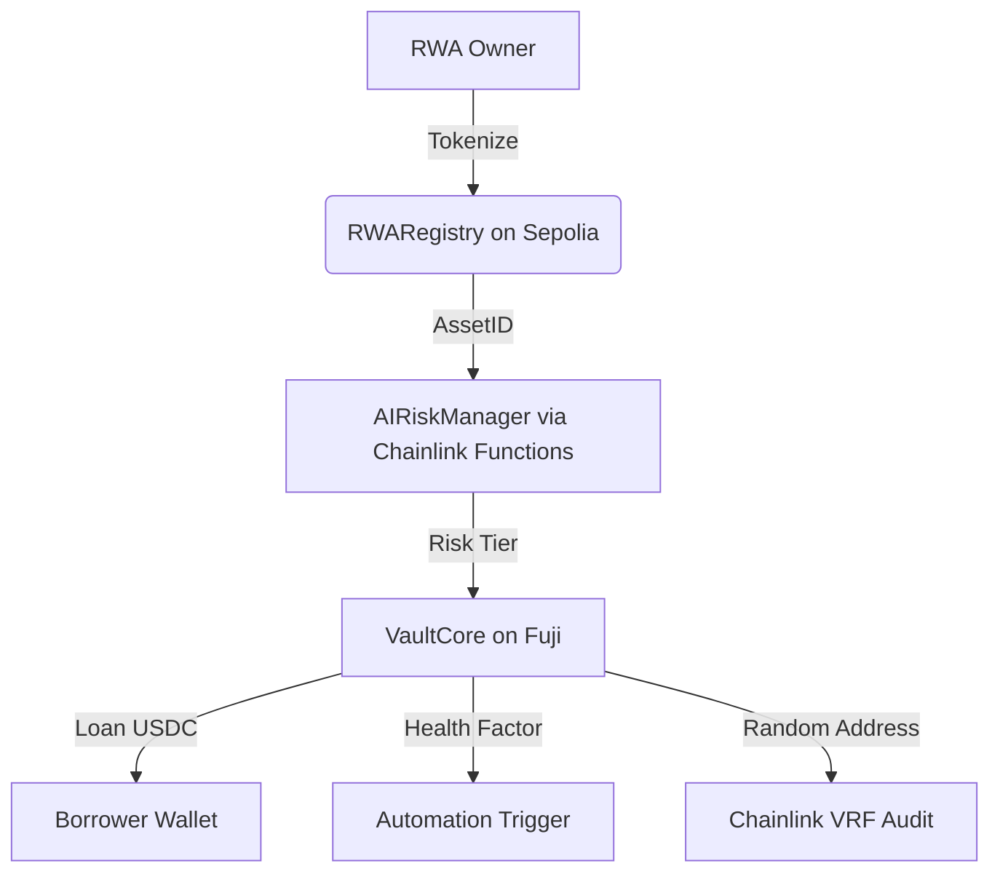

🚀 CoreVault Protocol
The Future of Private Credit — AI-Native · Cross-Chain · RWA-Powered

🏁 Submission for Chromion: A Chainlink Hackathon
Targeting: Onchain Finance · Grand Prize · Avalanche · ElizaOS · AWS Bedrock

VaultAI Protocol enables lending against tokenized real-world assets (RWAs) using AI-based risk scoring and full-stack Chainlink infrastructure — including CCIP, Automation, Functions, VRF, and Data Feeds. Designed for predictive liquidation protection, fair risk exposure, and seamless cross-chain credit flows.

## 📊 Pitch Deck

👉 [View Presentation](https://drive.google.com/file/d/17KYglePYp3Muf8dYQAHLGkqQC_qzYoi0/view?usp=sharing)

📦 Deployed Contracts

| Contract      | Network          | Address                                    |
| ------------- | ---------------- | ------------------------------------------ |
| AIRiskManager | Avalanche Fuji   | 0xDc1Fd6267FB58A2c91B00ac4187fCd819Bf93bCb |
| VaultCore     | Avalanche Fuji   | 0x454A4226aB2Eee18d747D146f10cB432c2Cf9a67 |
| CCIPRouter    | Avalanche Fuji   | 0xfa0DA9602CFfe09e2860caa7ec01b94b0aDd4458 |
| RWARegistry   | Ethereum Sepolia | 0xDc1Fd6267FB58A2c91B00ac4187fCd819Bf93bCb |

🛠️ Chainlink Services Used

| Service              | Purpose                                         |
| -------------------- | ----------------------------------------------- |
| Chainlink CCIP       | Cross-chain loan transfer & messaging           |
| Chainlink Automation | Liquidation health check and execution triggers |
| Chainlink Functions  | AI-based off-chain risk scoring via AWS Lambda  |
| Chainlink Data Feeds | Price feeds (ETH/USD, USDC/USD)                 |
| Chainlink VRF        | Randomized borrower audit selection             |

💡 How It Works

1. User tokenizes an RWA on Ethereum Sepolia via RWARegistry
2. Chainlink Functions calls an AWS Lambda AI model to generate a risk score
3. If risk tier ≥ B, a loan is approved and issued from VaultCore on Avalanche
4. Cross-chain messaging handled via Chainlink CCIP
5. Chainlink Automation monitors health factor for liquidations
6. Chainlink VRF randomly selects addresses for audit checks

🧪 How to Run Locally

1. Clone repo and install deps:

   ```bash
   git clone https://github.com/your-org/vaultai-protocol
   cd vaultai-protocol
   npm install
   ```
2. Set up .env with RPCs and private key
3. Deploy contracts via Hardhat

   ```bash
   npx hardhat deploy --network fuji
   ```
4. Start frontend (optional):

   ```bash
   cd frontend && npm run dev
   ```

🎯 Tracks Targeted

* ✅ Chainlink Onchain Finance — RWA tokenization + AI lending
* ✅ Chainlink Grand Prize — advanced Chainlink stack usage
* ✅ Avalanche Track — primary deployment on Fuji C-Chain
* ✅ ElizaOS — multi-agent AI orchestration for DeFi
* ✅ AWS x Bedrock — Lambda + AI scoring + Chainlink Functions

🧱 Repo Structure

| Folder     | Purpose                                |
| ---------- | -------------------------------------- |
| /contracts | All Solidity contracts (Hardhat-ready) |
| /frontend  | React + Wagmi UI for borrower flows    |
| /aws       | AWS Lambda AI risk model + API route   |

⚙️ Tech Stack

* Solidity (0.8.x), Hardhat, OpenZeppelin
* Chainlink CCIP, Automation, VRF, Data Feeds, Functions
* React + TypeScript + TailwindCSS + Wagmi
* AWS Lambda + Python for AI
* PostgreSQL (optional) for off-chain analytics

🤖 AI Risk Engine

* Inputs: creditScore, income, assetValue (JSON)
* Hosted as AWS Lambda
* Returns A/B/C risk tier to VaultCore via Chainlink Functions
* Risk tier used for loan approval & interest rate

🔐 Security & Compliance Simulation

* KYC placeholder on frontend
* Role-based access for contract actions
* Audit log via contract events
* Randomized audit sample via VRF

🎨 Architecture Overview




